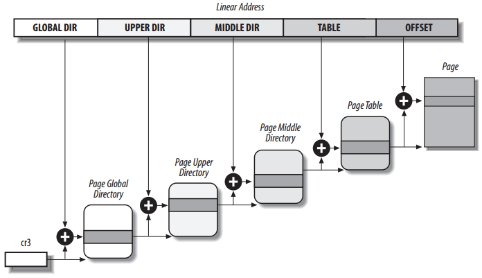
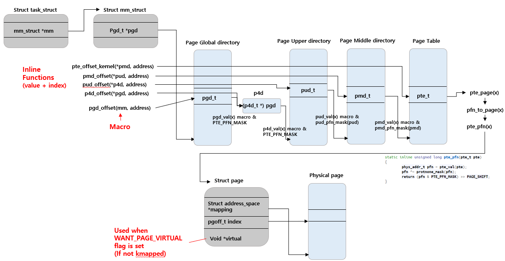
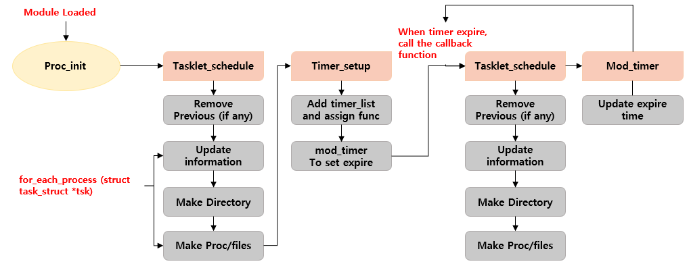
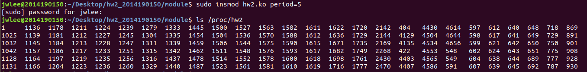
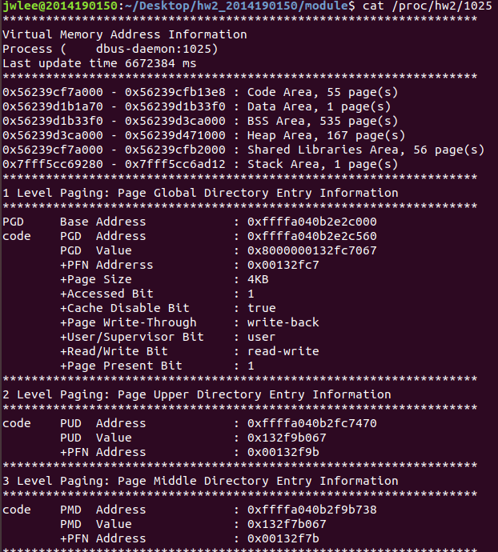
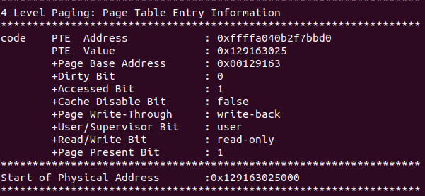

## User Process Monitoring

Writer: [Jungwoo Lee](https://github.com/ljwoo94)

### 0 Purpose

- To understand how Linux kernel performs memory management
- To learn how to use tasklet in bottom-half with module programming


### 1 Background



- The Linux updated paging technique from 3 level into 4 level to prepare for the 128 bits system in future.

- Most of mechanism of paging is similar to regular paging and 3-level paging. However, the biggest difference is a data structure of page and the simplified but more separated header files in the kernel. 



​												         *<Flow Chart of 4-Level-Paging>*

- It is possible to observe how the 4-level-system operates in 64bit environment and the memory usage by analyzing mm_struct(PCB) data structure.


### 2 Implementation




- **Data structure**

  ```c
  struct mm_info {
  	pid_t pid;
      char *comm;
      unsigned long up_time;
      struct mm_struct  *mm;
      pgd_t *pgd;
      pud_t *pud;
      pmd_t *pmd;
      pte_t *pte;
      
      struct list_head list;
  };
  extern struct list_head mm_list;
  ```

- **Used**

  - *Tasklet, kzalloc, kfree, mod_timer, proc filesystem, for_each_process, linux/sched/signal.h*

  

### 3 Result

- **Proc fs after module loaded**



- **Example Proc file**

 

- PID may result differently on the other environments.

### 4 Reference

- [Linux Memory](http://egloos.zum.com/dojeun/v/317480)

- [Tasklet](https://onecellboy.tistory.com/52)

- [Physical Address](https://stackoverflow.com/questions/6252063/how-to-get-the-physical-address-from-the-logical-one-in-a-linux-kernel-module/6262158#6262158)

  